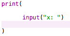

# 在mac安装python

* 打开python官方网站，单击"Downloads"链接,选择“Download macOS 64-bit installer"开始下载并安装

* 安装完成后打开终端，输入“python”运行，开启python，成功开启终端会显示关于python的版本等信息；

* 然后在输入"print “hello，world!""回车运行后会在下方输出结果，需要注意编写过程中符号的中英文状态


* 当python的版本从python2更新为python3时，编程的语句也需发生一定的变化，例如：print后的语句需要放在（）中


* 在Spyder中输入python2语句后出现错误，后更改为python3成功运行，如下图所示：


***

# 算法

* 数字和表达式

	* 浮点数与任何数的计算结果都为浮点数；

	* 当两个整数相除时，计算结果的小数将会被截除，只剩下整数部分；（3.0前版本）

	* //（双斜线）能够实现整除；

	* % 取余——x%y的结果是x除以y的余数

	* `**` 幂（乘方）的运算符

* 十六进制数：


* 变量

	* x=a 即将a值赋给了变量x，然后就能够在表达式中使用该变量

		* 如:

        

* 代码中显示为：

	* 

	* 

* 为不同的变量赋值并使其参与运算

	* 如

		

		

* if语句

	* if+条件:结果（在条件语句后使用":"(冒号)将后面的语句分隔开）

		* 当条件为正确时，输出结果中的内容，错误时无输出；

		* 如：

		

# 函数

* 幂函数 —— pow(a,b)

	* 如：

	

* 绝对值 —— abs(-a)

* 取整(把浮点数四舍五入为最接近的整数) —— round(a/b)

# 模块

* 使用import命令来导入模块以实现在Python中增强和拓展其功能

	* 向下取整 —— math.floor(a) int函数可将浮点数转换为整数

		* 

         <a style="color:red">注:int函数可将浮点数转换为整数</a>

* “from 模块 import 函数”输入此命令后，就可以不用在调用多个不同模块的同名函数时都加上模块名

	* 如：import命令的另一种表现形式，<b>sqrt函数用于计算数平方根</b>
	 

# cmath和复数

* 求负数的算术平方根，负数的算术平方根是虚数，但sqrt只能运算浮点数，所以需要新增<b style="color:red">cmath</b>模块实现复数（实数以及虚数的总和）的运算；


<a styl="color:blue">*注：其中1j是个虚数，而j是虚数的结尾，就像L是长整型的结尾;并且Python本身也支持复数运算</a>

# _future_模块

<strong>交互式解释器能够在Python实时检验解决方案；</strong>

* 当输入以下代码（保存后）并运行，在解释器窗口出现了报错提醒
```
name=raw_input("What is your name?")
print("Hello."+name+"!")
```


<u style="color:red">报错如下图所示:</u>


>报错信息为“raw_input没有定义”，原因是"raw_input"是python 2.x版本中所使用的语法，所以在版本为3.x的python语法解释器中无法被执行，故将“raw_input()”更改为“input()”


* 参考文献：

	* CSDN中的博文 —— [python ： raw_input is not defined](http://blog.csdn.net/wan2three/article/details/18699537)

	* stack Overflow ——[Raw_Input() Is Not Defined [duplicate]
](https://stackoverflow.com/questions/35168508/raw-input-is-not-defined)

* 对版本不同的Python语法的改变进行更深的了解

	* CSDN ——[Python raw_input和input总结 在版本2和版本3中的区别](http://blog.csdn.net/cvTingWei/article/details/7955075)

<b>总结：</b>在Python2.x版本中"raw_input"用于输入字符串与数字，成功后返回的也是字符串和数字，"input"在Python2.x版本中的作用只能输入数字而不能输入字符串，而在Python3.6.3版本（本人目前使用的版本）中对"raw_input"与"input"的功能进行了整合，所以此版本中不存在"raw_input"；


